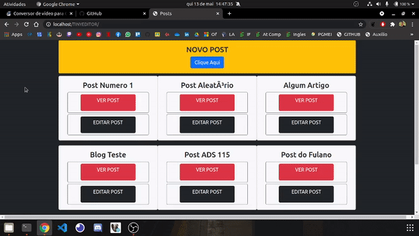

# tinyeditor

# Repositório destinado ao estudo do editor de texto tiny editor

- Contém um arquivo sql que deve ser salvo localmente para poder salvar os posts criados com o editor de texto
- O editor de texto converte edições realizadas para codificação html e salva na base de dados onde é possivel visualizar posteriormente
